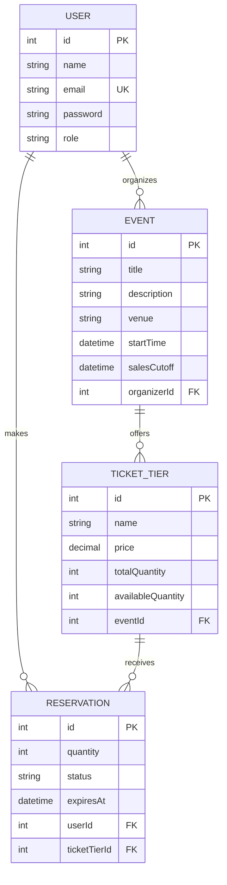

# Eventify — Entity Relationship Diagram

```mermaid
erDiagram
    USER ||--o{ EVENT : organizes
    USER ||--o{ RESERVATION : makes
    EVENT ||--o{ TICKET_TIER : offers
    TICKET_TIER ||--o{ RESERVATION : receives

    USER {
        int id PK
        string name
        string email UK
        string password
        string role
    }

    EVENT {
        int id PK
        string title
        string description
        string venue
        datetime startTime
        datetime salesCutoff
        int organizerId FK
    }

    TICKET_TIER {
        int id PK
        string name
        decimal price
        int totalQuantity
        int availableQuantity
        int eventId FK
    }

    RESERVATION {
        int id PK
        int quantity
        string status
        datetime expiresAt
        int userId FK
        int ticketTierId FK
    }
```
